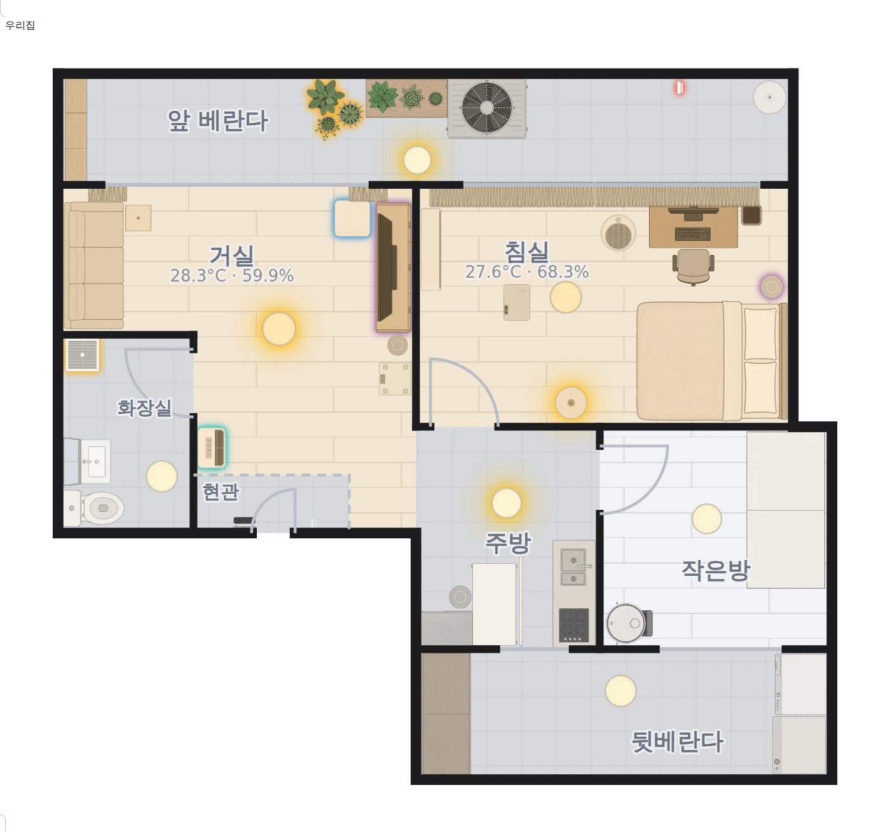

# lemon-floorplan-card

SVG 평면도 위에서 가구를 눌러 기기를 제어하는 Home Assistant 커스텀 카드입니다.



- **가구 짧게 누르기**로 켜고 끄고, **길게 누르기**로 more-info 를 엽니다.
- **빈 바닥을 누르면** 그 방의 기기 목록이 팝업으로 열립니다.
- 켜진 조명은 발광하고, 조명이 아닌 기기는 도메인 색 테두리만 두릅니다.
- **방 색은 그 방의 온도입니다.** 기기가 켜졌는지는 가구가 알립니다.
- 방과 기기의 매핑을 설정에 적지 않습니다. HA area 레지스트리를 런타임에 읽습니다.

## 설치

HACS 우상단 메뉴에서 **Custom repositories** 를 열고
`LemonDouble/lemon-floorplan-card` 를 Type **Dashboard** 로 추가한 뒤, 목록에서
받습니다. 리소스 등록은 HACS 가 처리합니다. 마지막에 **Ctrl+Shift+R** 로 새로고침해
주십시오. ([HACS — Custom repositories](https://www.hacs.xyz/docs/faq/custom_repositories/))

대시보드에 Manual card 로 추가합니다.

```yaml
type: custom:lemon-floorplan-card
```

평면도가 빌드에 내장돼 있어 이 한 줄로 뜹니다.

<details>
<summary>수동 설치</summary>

`dist/lemon-floorplan-card.js` **한 개**를 `config/www/` 에 복사하고, Settings →
Dashboards → 우상단 메뉴 → Resources 에서 `/local/lemon-floorplan-card.js` 를
**JavaScript Module** 로 등록합니다.
</details>

## 설정

| 키 | 설명 |
|---|---|
| `title` | 카드 제목 (생략 가능) |
| `floorplan` | 외부 SVG 경로. 생략하면 빌드에 내장된 평면도를 씁니다 |
| `hold_time` | 길게 누르기 판정 시간 (ms, 기본 500) |
| `aliases` | `@key` 를 실제 entity_id 로 잇습니다 (아래 "별칭" 참고) |
| `exclude_devices` | 방 팝업에서 통째로 뺄 device (id 또는 이름) |
| `exclude` | 방 팝업에서 뺄 엔티티 |
| `demote` | "자주 쓰는 것" 에서만 뺄 엔티티. 전체 보기에는 남습니다 |
| `popup_features` | 팝업 타일의 feature 목록을 엔티티별로 **교체** (`entity_id: [feature, …]`) |
| `show_env` | 방 이름 아래 온·습도 표시. 기본 켜짐, `false` 로 끕니다 |
| `room_tint` | 방 색을 정하는 기준. `temperature`(기본) / `device` / `off` |
| `temp_bands` | 온도 구간 경계(℃). 기본 `{cold: 18, cool: 22, warm: 26, hot: 29}` |
| `air` | 평면도 아래 공기질 줄에 놓을 엔티티 목록 |
| `outdoor` | 카드 제목 옆에 실외 온·습도 표시. `weather` 엔티티 하나 또는 센서 목록 |
| `rooms.<area>.pin` | 방 팝업 "자주 쓰는 것" 에 **추가** |
| `rooms.<area>.primary` | "자주 쓰는 것" 을 통째로 **교체** (`pin` 무시) |
| `rooms.<area>.env` | 그 방의 대표 온·습도 센서를 못박습니다 (아래 주의) |
| `layout` | 가구 위치 덮어쓰기. 카드 편집기가 자동으로 기록합니다 |

```yaml
type: custom:lemon-floorplan-card
room_tint: temperature
air: [sensor.air_co2, sensor.air_pm25, sensor.air_pm10]
outdoor: weather.forecast_home     # 센서를 쓴다면 [sensor.out_temp, sensor.out_humidity]
exclude_devices:
  - 공유기                       # device 이름 또는 id
demote:
  - media_player.living_speaker   # 자주 쓰는 것 대신 전체 보기로
popup_features:                   # 이 에어컨만 스윙까지 노출
  climate.bedroom_ac:
    - {type: climate-hvac-modes, style: dropdown}
    - {type: target-temperature}
    - {type: climate-fan-modes, style: dropdown}
    - {type: climate-swing-modes, style: dropdown}
rooms:
  living:
    env: [sensor.living_temperature, sensor.living_humidity]
```

### 방 색

기본은 온도입니다. 조명이 켜졌는지는 가구가 발광해서 알 수 있지만 온도는 숫자를 읽기
전에는 알 수 없기 때문입니다. **쾌적 구간은 일부러 칠하지 않습니다** — 늘 물들어
있으면 경고가 묻힙니다. 경계는 `temp_bands` 로 옮길 수 있고, 온습도 센서가 없는 방은
칠하지 않습니다. `room_tint: device` 로 하면 켜진 기기 종류로 칠합니다.

`outdoor` 를 함께 적으면 제목 옆에 실외 온·습도가 붙습니다. 방이 26℃ 라는 사실만으로는
창을 열지 말지 알 수 없고 바깥이 몇 도인지를 알아야 판단이 서기 때문에, 평면도를 보기
전에 눈에 들어오는 자리에 둡니다.

### 공기질

`air` 에 엔티티를 적으면 평면도 아래에 한 줄이 생깁니다. 안 적으면 그 줄은 없습니다.
라벨·단위·등급은 엔티티의 `device_class` 로 정하므로 설정에는 엔티티만 적습니다. 아는
종류는 `carbon_dioxide`, `pm25`, `pm10`, `pm1`, `volatile_organic_compounds` 이고 모르는
것은 조용히 건너뜁니다.

좋음·보통일 때는 색을 주지 않고, 주의·나쁨일 때만 숫자가 물듭니다. PM 등급은
[환경부 미세먼지 예보 기준](https://www.me.go.kr/mamo/web/index.do?menuId=16201)을
따랐습니다. 항목을 누르면 more-info 가 열립니다.

### 온습도 센서를 못박아야 할 때

`rooms.<area>.env` 를 안 적으면 그 방에서 `device_class` 가 temperature/humidity 인
센서를 자동으로 찾습니다. 방에 온도계가 하나뿐이면 적지 않아도 됩니다.

문제는 **온도계가 둘 이상인 방**입니다 (전용 온습도계에 더해 제습기·공기청정기에도
내장 센서가 있는 경우). 어느 쪽이 잡힐지가 device 이름 정렬 순서에 달리는데, 기기
내장 온도는 실온과 몇 도씩 어긋납니다. 이런 방에는 `env` 로 대표 센서를 지정해
주십시오.

### 별칭

Zigbee IEEE 주소가 박힌 자동 생성 entity_id 를 SVG 에 직접 쓰지 않으려면 `@key` 별칭을
쓸 수 있습니다. SVG 에는 별칭만 두고, 실제 매핑은 대시보드 설정에 적습니다.

```svg
<image data-entity="@ceiling-living" …/>
```
```yaml
aliases: { ceiling-living: switch.0x00124b00253f_top }
```

이 저장소의 평면도가 이 방식을 쓰는 이유는 저장소가 공개이기 때문입니다. HACS 는
공개된 정보만 읽을 수 있어 비공개 저장소를 쓸 수 없습니다.
([HACS — Private repositories](https://www.hacs.xyz/docs/faq/private_repositories/))

## 카드 편집기

대시보드에서 이 카드를 편집하면 평면도가 뜹니다. 가구를 끌어 옮기고, 휠로 크기를,
Shift+휠로 15° 회전을, 방향키로 한 칸씩(Shift 는 10칸) 조정할 수 있습니다. 저장하면
`layout` 에 기록되고, 옮긴 것만 저장되며 나머지는 SVG 기본값을 씁니다. "배치 되돌리기"
로 전부 원복합니다.

## 참고

- [HA — Custom card 개발 문서](https://developers.home-assistant.io/docs/frontend/custom-ui/custom-card/)
- [HACS — Plugin (Dashboard) 게시 규칙](https://hacs.xyz/docs/publish/plugin/)
