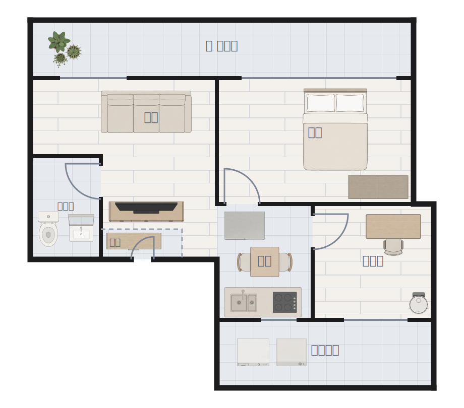

# lemon-floorplan-card

SVG 평면도 위에서 가구를 눌러 기기를 제어하는 Home Assistant 커스텀 카드.



- **가구 짧게 누르기** → 켜고 끄기 / **길게 누르기** → more-info
- **빈 바닥 누르기** → 그 방 기기 목록 팝업
- 켜진 조명은 발광하고, 조명 아닌 기기는 도메인 색 테두리만 두른다
- **방 색은 그 방 온도다.** 기기가 켜졌는지는 가구가 알린다 → [§4 방 색](#방-색은-온도다)
- 방↔기기 매핑을 설정에 적지 않는다. HA area 레지스트리를 런타임에 읽는다

---

## 1. 설치

HACS → ⋮ → **Custom repositories** → `LemonDouble/lemon-floorplan-card` / Type **Dashboard**
→ 목록에서 받기 → **Ctrl+Shift+R**. 리소스 등록은 HACS 가 알아서 한다.

대시보드에 Manual card 로:

```yaml
type: custom:lemon-floorplan-card
```

평면도는 빌드에 내장돼 있어서 이 한 줄로 뜬다.

<details>
<summary>수동 설치</summary>

`dist/lemon-floorplan-card.js` **한 개**를 `config/www/` 에 복사하고,
Settings → Dashboards → ⋮ → Resources 에서 `/local/lemon-floorplan-card.js` 를
**JavaScript Module** 로 등록한다.
</details>

---

## 2. 설정

| 키 | 설명 |
|---|---|
| `title` | 카드 제목 (생략 가능) |
| `floorplan` | 외부 SVG 경로. 생략하면 빌드에 내장된 평면도를 쓴다 |
| `hold_time` | 길게 누르기 판정 시간 (ms, 기본 500) |
| `aliases` | `@key` → 실제 entity_id. → [§5](#5-공개-저장소와-별칭) |
| `exclude_devices` | 방 팝업에서 통째로 뺄 device (id 또는 이름) |
| `exclude` | 방 팝업에서 뺄 엔티티 |
| `demote` | "자주 쓰는 것" 에서만 뺄 엔티티. 전체 보기에는 남는다 |
| `popup_features` | 팝업 타일의 feature 목록을 엔티티별로 **교체** (`entity_id: [feature, …]`) |
| `show_env` | 방 이름 아래 온·습도 표시. 기본 켜짐, `false` 로 끈다 |
| `room_tint` | 방 색을 무엇으로 정할지. `temperature`(기본) / `device` / `off` → [§4](#방-색은-온도다) |
| `temp_bands` | 온도 구간 경계(℃). 기본 `{cold: 18, cool: 22, warm: 26, hot: 29}` |
| `air` | 평면도 아래 공기질 줄에 놓을 엔티티 목록 → [§4](#공기질은-방이-아니라-평면도-아래에) |
| `rooms.<area>.pin` | 방 팝업 "자주 쓰는 것" 에 **추가** |
| `rooms.<area>.primary` | "자주 쓰는 것" 을 통째로 **교체** (`pin` 무시) |
| `rooms.<area>.env` | 그 방의 대표 온·습도 센서를 못박는다 (아래 주의) |
| `layout` | 가구 위치 덮어쓰기. 카드 편집기가 자동으로 기록 |

> **`env` 를 언제 적어야 하나.** 안 적으면 방 안에서 `device_class` 가
> temperature/humidity 인 센서를 자동으로 찾는데, 방에 온도계가 둘 이상이면
> (전용 온습도계 + 제습기·공기청정기 내장 센서) **어느 쪽이 잡힐지가 device 이름
> 정렬 순서에 달린다.** 기기 내장 온도는 실온과 몇 도씩 어긋난다 — 이 집 거실은
> 온습도계 28.3℃ 인데 제습기 내장은 25℃ 였다. 방에 온도계가 하나뿐이면 안 적어도 된다.

현재 이 집 설정 (대시보드 `홈` → 첫 섹션):

```yaml
type: custom:lemon-floorplan-card
exclude_devices:            # 공유기 센서 13개, 중복 TV device 등
  - 9623f9049e3a2b9dde498311bee3ec13
  - ...
aliases:                    # Zigbee IEEE 가 박힌 ID 7개
  ceiling-geosil: switch.0x...._top
  ...
demote:                     # 스피커는 자주 쓰는 것 대신 전체 보기로
  - media_player.geosil_seupikeo
  - media_player.cimsil_seupikeo
  - media_player.jubang_seupikeo
  - media_player.jib_jeonce
popup_features:             # 벽걸이(침실)만 팬 회전(스윙)까지 노출
  climate.cimsil_byeokgeori_eeokeon_local:
    - {type: climate-hvac-modes, style: dropdown}
    - {type: target-temperature}
    - {type: climate-fan-modes, style: dropdown}
    - {type: climate-preset-modes, style: dropdown}
    - {type: climate-swing-modes, style: dropdown}
rooms:
  geosil: { env: [...거실 온습도계] }     # 제습기 내장 온도가 잡히지 않게
  cimsil: { env: [...침실 온습도계] }     # 공기청정기 내장 온도가 잡히지 않게
```

> climate 팝업 타일의 기본 feature 는 hvac·온도·풍량·운전기능(무풍) 4종이다.
> 거실 스탠드에 스윙(바람문)을 안 주는 이유: 바람문은 무풍 중 조작이 무시되는
> 데다 기기 뷰의 전용 스위치가 이미 있다.

> 이 집 온습도계는 entity_id 와 실제 위치가 어긋나 있다 (`geosil…temperature` 가
> 침실). `env` 에 적을 때 ID 만 보고 고르지 말 것 — [§6](#이-집-ha-특유) 참고.

---

## 3. 고치려면 — 무엇을 바꾸느냐에 따라 경로가 다르다

### (a) 가구를 조금 옮기고 싶다 → **HA 안에서, 배포 불필요**

대시보드 → 편집 → 이 카드 편집. 편집창에 평면도가 뜬다.

| 끌기 | 휠 | Shift+휠 | ←↑↓→ |
|---|---|---|---|
| 이동 | 크기 | 15° 회전 | 1칸 (Shift 10칸) |

HA 저장 버튼을 누르면 `config.layout` 에 기록된다. **옮긴 것만** 저장되고
나머지는 SVG 기본값을 쓴다. "배치 되돌리기" 로 전부 원복.

### (b) 기본 배치 자체를 바꾸고 싶다 → `editor.html` → 빌드 → 릴리스

```bash
python3 -m http.server 8899        # 저장소 루트에서
# http://127.0.0.1:8899/editor.html
```

끌어 옮기고 **SVG 출력** → 나온 블록으로 `floorplan.svg` 의
`<g id="fp-furniture">…</g>` 를 통째로 교체 → [§(e) 배포](#e-배포).

> 출력에 `data-entity` 와 `id` 가 포함된다. 빠뜨리면 엔티티 연결이 전멸하므로
> **블록 통째로** 교체할 것.

### (c) 벽·방 모양을 바꾸고 싶다 → `floorplan.svg` 직접

좌표계와 그리드가 파일 맨 위 주석에 정리돼 있다. 방 도형은 `<defs>` 에 한 번만
정의하고 `fp-floor` / `fp-rooms` 가 `<use>` 로 공유하므로 **한 군데만** 고치면 된다.

`preview.html` 에 "좌표 찍기" 가 있다 (클릭하면 viewBox 좌표 + % 출력).

카드와의 계약은 `area_id` 두 군데뿐이다.

| 무엇 | 어디 | 없으면 |
|---|---|---|
| 방 polygon 의 `id` (`room-<area_id>`) | `fp-rooms` | 그 방은 눌러도 팝업이 안 뜬다 |
| 방 이름 라벨의 `data-area` | `fp-labels` | 그 방 이름 아래에 온습도가 안 붙는다 |

### (d) 가구를 추가하고 싶다 → `tools/gen_furniture.py`

```bash
cd tools
uv run --with openai python gen_furniture.py sofa fridge      # 일부만
uv run --with openai python gen_furniture.py                  # 전체
```

`low` 기준 장당 약 $0.0065. 뽑은 뒤 누끼 → 트림 → WebP:

```bash
uv run --with rembg --with onnxruntime --with pymatting --with pillow \
  ~/.claude/skills/gpt-image/scripts/cutout.py assets/raw/ assets/out/ --preview '#2b6cb0'
# assets/out/preview/ 를 반드시 눈으로 확인 (halo·구멍)
```

그 다음 `fp/*.webp` 로 256px 트림·축소 → `floorplan.svg` 에 `<image>` 추가
(`id="o-<에셋>-<번호>"`, 엔티티를 걸 거면 `data-entity`) → 배포.

프롬프트 함정은 [§6](#6-함정-모음) 참고.

### (e) 배포

```bash
python3 tools/build.py                              # dist/ 단일 JS 생성
git add -A && git commit -m "..." && git push
gh release create v1.5.0 --title v1.5.0 --notes "..."
```

그 다음 HACS 에서 업데이트를 누르거나, MCP 로:
`ha_manage_hacs(action="download", repository_id="LemonDouble/lemon-floorplan-card", version="v1.5.0")`

마지막에 **Ctrl+Shift+R**.

---

## 4. 구조

```
src/card.js          카드 본체 (편집 대상)
floorplan.svg        평면도 (편집 대상)
fp/*.webp            가구 에셋 37종
tools/build.py       fp/ + floorplan.svg → dist/ 단일 JS
tools/gen_furniture.py  gpt-image 로 가구 생성
dist/…js             HACS 배포본 (빌드 산출물, 커밋됨)

editor.html          가구 배치 편집기 (기본 배치용)
preview.html         평면도 확인 + 좌표 찍기
test.html            mock hass 로 카드를 구동하는 테스트 하네스
```

**SVG 레이어 순서** (아래 → 위):

```
fp-floor       바닥 재질. SVG <pattern> (마루/타일) — 이미지 0개, 다크모드 공짜
fp-furniture   가구 <image>. pointer-events:none
fp-rooms       방 히트영역 + 상태 틴트. 가구를 덮어야 하므로 가구보다 위
벽 / 창 / 단차 / 문
fp-labels      방 이름 + 온습도 (온습도 <text class="env"> 는 카드가 런타임 생성)
fp-hotspots    ← 카드가 런타임 생성. data-entity 있는 가구만 투명 rect
```

가구를 클릭 가능하게 하려면 방 폴리곤보다 위여야 하는데, 그러면 틴트가 가구
아래로 깔린다. 그래서 위치만 복사한 투명 rect 를 맨 위에 따로 깐다.
장식 가구는 rect 가 안 생기므로 클릭이 그대로 방으로 떨어진다.

**켜짐 표시**는 조명과 그 외를 가른다. 조명은 실제로 빛을 내니 넓게 발광시키고
(`drop-shadow` 6+16), 에어컨·세탁기 같은 건 실루엣을 따라 얇은 테두리만 준다(3+3).
에어컨이 등처럼 환하게 빛나면 어색해서다. 방 색이 온도를 맡게 된 뒤로 "무엇이 켜져
있나" 는 전적으로 가구 몫이라 예전(5+10, 2+2)보다 한 단계씩 세게 주고, `brightness`
도 함께 올린다 — 테두리만 밝으면 작은 기기는 멀리서 켜짐이 안 보인다.

무엇이 조명인지는 **도메인으로 못 가른다** — 천장등 7개가 전부 `switch` 도메인이고
같은 `switch` 에 환풍기·식물등 플러그도 섞여 있다. 그래서 오브젝트 id
(`o-<에셋>-<번호>`)에 박힌 에셋 이름으로 가른다. `src/card.js` 의 `LIGHT_ASSETS`.

```
light  ceiling-light · table-lamp · floor-lamp · led-strip   앰버 발광
cool   climate(heat 아님)   파랑     media  media_player   보라
heat   climate(heat)        주황     air    fan·humidifier 청록
alert  lock 해제 · binary_sensor 열림  빨강
on     그 외 (switch 플러그 · vacuum)  앰버 테두리
```

**`cover` 는 일부러 뺐다.** 커튼은 열린 것도 정상 상태라 발광시키면 늘 빛나고,
그러면 "켜짐" 과 구분이 안 된다. 대신 **실제로 걷히게 만든다.**

```svg
<image id="o-curtain-1" href="fp/curtain-panel.webp" data-curtain
       data-entity="cover.geosil_keoteun" x="91.1" y="155.8" width="309.7" height="16.7"/>
```

`data-curtain` 이 붙은 `<image>` 는 카드가 런타임에 **좌우 두 폭으로 복제**하고,
원본은 숨겨 "창의 어디부터 어디까지"를 알려주는 기준으로만 쓴다.

| 상태 | 한 폭의 폭 | 보이는 모습 |
|---|---|---|
| `closed` | 창의 50% | 두 폭이 맞닿아 창을 덮는다 |
| 그 외 | 창의 13% (`CURTAIN_OPEN`) | 양끝으로 물러나고 가운데 창이 드러난다 |

에셋은 **커튼 한 폭**(`curtain-panel.webp`) 하나뿐이고 `preserveAspectRatio="none"`
으로 폭에 맞춰 늘린다 — 넓으면 펼쳐진 천, 좁으면 뭉친 천으로 읽힌다.

> **왜 그림 두 장을 갈아끼우지 않았나.** 처음엔 열린 커튼·닫힌 커튼 두 에셋을
> `href` 로 교체했는데, 이 크기에서는 한쪽이 커튼봉, 다른 쪽이 골판지처럼 읽혀
> 둘 다 커튼으로 안 보였다. 명도를 눌러 대비를 줘도 마찬가지였다 — **형태가
> 바뀌지 않으면 알아볼 수 없다.**
>
> SVG 의 `<image>` 를 애초에 네 개로 두지 않은 것은 가구 편집기 때문이다.
> 커튼이 네 조각으로 잡히면 드래그도 `layout` 저장도 조각마다 따로 논다.

`drop-shadow` 의 길이는 SVG 사용자 단위(viewBox 920 기준)라 화면 폭이 달라져도
굵기 비율이 유지된다. 모바일에서 따로 손볼 게 없다.

### 방 색은 온도다

조명은 어차피 가구가 발광해서 눈에 띄지만 온도는 숫자를 읽기 전에는 알 수 없다.
방 전체를 물들이는 자리는 "읽지 않고도 알아야 하는 것" 에 주는 편이 낫다고 보고
v1.7 에서 기본을 온도로 옮겼다 (`room_tint: device` 로 예전 동작 복원).

```
< 18   temp-cold  파랑      18~22  temp-cool  하늘
22~26  (안 칠함)            26~29  temp-warm  주황     >= 29  temp-hot  빨강
```

쾌적 구간을 일부러 비워 둔다 — 늘 물들어 있으면 경고가 묻힌다. 경계값은 위 칸에
속한다(26.0 은 쾌적이 아니라 warm). 경계는 `temp_bands` 로 옮길 수 있고, 온습도
센서가 없는 방은 칠하지 않는다.

`room_tint: device` 는 켜진 기기 종류로 칠하던 방식이다. **우선순위는
`DEVICE_TINT` 표의 순서**이고 `heat > cool > media > warm` 이다.

> v1.6 까지 이 우선순위는 `tint = …` 와 `tint ||= …` 의 차이, 그리고 `room.all`
> 배열 순서에 묻혀 있었다. 그래서 조명과 TV 가 함께 켜진 방이 배열 순서에 따라
> 앰버가 되기도 보라가 되기도 했다. 표로 꺼내면서 순서와 무관해졌다.

### 공기질은 방이 아니라 평면도 아래에

`air` 에 엔티티를 적으면 평면도 아래 한 줄이 생긴다. 안 적으면 그 줄은 없다.

```yaml
air: [sensor.air_detector, sensor.tuya_air_detector_pm25, sensor.tuya_air_detector_pm10]
```

배경 있는 칩으로 만들었다가 **항목이 셋만 돼도 카드 아래가 무거워져서** 방 이름
아래 온습도와 같은 문법의 담백한 한 줄로 되돌렸다. 평면도가 주인공이고 이건
곁들이는 정보다. 항목을 계속 늘리고 싶어지면 그 전에 이 판단을 다시 볼 것.

라벨·단위·등급은 **`device_class` 로 정하므로 설정에는 엔티티만 적는다.**
아는 종류는 `carbon_dioxide` · `pm25` · `pm10` · `pm1` ·
`volatile_organic_compounds` 이고, 모르는 것은 조용히 건너뛴다.

| | 좋음 | 보통 | 주의 | 나쁨 |
|---|---|---|---|---|
| CO₂ (ppm) | <800 | <1000 | <1500 | 그 이상 |
| PM2.5 (㎍/㎥) | <16 | <36 | <76 | 그 이상 |
| PM10 (㎍/㎥) | <31 | <81 | <151 | 그 이상 |
| VOC (mg/㎥) | <0.3 | <1 | <3 | 그 이상 |

CO₂ 는 환기 권장선 1000ppm, PM 은 한국 환경부 등급을 따랐다. **좋음·보통은 색을
주지 않는다** — 방 온도 틴트에서 쾌적 구간을 비워둔 것과 같은 이유다. 주의·나쁨일
때 숫자만 물든다. 항목을 누르면 more-info 가 열린다.

방마다 칠하지 않고 한 줄로 뺀 이유는 이 집 측정기가 침실 하나뿐이라 방별로 나눌
데이터가 없어서다. 집이 작아 전체가 같은 상태라고 봐도 된다는 판단이 깔려 있으니,
방마다 측정기가 생기면 이 결정을 다시 볼 것.

### 스타일이 두 파일에 나뉜 기준

같은 요소의 CSS 가 `floorplan.svg` 와 `src/card.js` 양쪽에 있다. 규칙은 하나다.

| | 어디에 | 예 |
|---|---|---|
| 정적인 생김새 | `floorplan.svg` 의 `<style>` | 바닥·벽·창·방 기본형, `.label` / `.env` |
| 카드가 런타임에 붙이는 상태 | `src/card.js` 의 `_render()` | `.room[data-tint]`, `image[data-on]`, `.hotspot` |

`data-*` 가 걸리는 스타일이면 card.js, 아니면 SVG 로 간다. CSS 를 JS 문자열에
넣어야 하는 것은 HACS 가 릴리스에서 `.js` 하나만 가져가기 때문이다([§6](#hacs)).

**방↔기기 매핑**은 `hass.callWS` 로 `config/{area,device,entity}_registry/list` 를
한 번 읽어 만든다. 엔티티의 area 는 자기 값이 우선이고 없으면 device 것을 물려받는다
(2구 스위치처럼 방을 걸치는 기기가 엔티티 레벨로 덮어써져 있다).

**방 팝업의 "자주 쓰는 것"** 은 임의로 고르지 않는다. device 안에서 우선순위가
가장 높은 도메인을 찾고 그 도메인 엔티티를 **전부** 대표로 쓴다.

```
climate > light > cover > lock > media_player > fan
        > humidifier > vacuum > water_heater > valve > siren > switch
```

에어컨 device → `climate` 하나 (companion 스위치 10개는 접힘).
2구 벽스위치 → `switch` 두 개 다 노출.

---

## 5. 공개 저장소와 별칭

저장소가 공개라 Zigbee IEEE 주소가 박힌 자동 생성 entity_id 는 SVG 에 직접 쓰지
않는다. `@key` 별칭으로 두고 실제 매핑은 **HA 안에만 있는 대시보드 설정**에 적는다.

```svg
<image data-entity="@ceiling-geosil" …/>          <!-- 공개되는 SVG -->
```
```yaml
aliases: { ceiling-geosil: switch.0x…_top }        # 대시보드 설정 (비공개)
```

IEEE 가 안 박힌 나머지 25개는 그냥 entity_id 를 직접 쓴다. 별칭이 필요한 건 7개뿐.

> HACS 는 **비공개 저장소를 아예 못 읽는다** (공식 FAQ). 그래서 저장소를 비공개로
> 돌리는 선택지는 없다.

---

## 6. 함정 모음

작업하면서 실제로 걸렸던 것들. 다시 밟지 말 것.

### HACS

- **릴리스에서 "레포 이름과 같은 `.js`" 하나만 가져간다.** `dist/` 에 `floorplan.svg`
  를 나란히 뒀더니 받아가지 않았다 (`/hacsfiles/…/floorplan.svg` → 404).
  그래서 빌드가 평면도·에셋을 전부 JS 한 파일에 인라인한다.
- **`dist/` 보다 저장소 루트의 동명 파일을 먼저 가져간다.** 문서상 순서는
  `dist` → 릴리스 → 루트인데 실제로는 루트가 이겼다. 그래서 소스를 `src/card.js`
  로 옮겨 `lemon-floorplan-card.js` 가 `dist/` 에만 존재하게 했다.
- 비공개 저장소 불가.

### SVG / 브라우저

- **인라인한 SVG 안의 상대경로는 "지금 보고 있는 페이지 URL" 기준으로 풀린다.**
  HA 에서 `/lovelace/home` 이면 `fp/x.webp` → `/lovelace/fp/x.webp` 가 되고,
  HA 는 모르는 경로에 SPA 폴백으로 `index.html` 을 **200 으로** 내려준다.
  404 도 안 뜨고 그냥 엑박. `_loadSvg` 가 절대화로 처리한다.
- **`<image>` 의 클릭 판정은 보이는 그림이 아니라 `x/y/width/height` 상자 전체다.**
  `preserveAspectRatio` 때문에 여백도 클릭을 먹고, 겹치면 문서 순서상 마지막이
  무조건 이긴다. 편집기·카드 모두 "겹친 것 중 면적이 작은 쪽" 을 고른다.
- **같은 에셋을 여러 번 쓰면 인라인이 그만큼 반복된다.** 천장등 7개 때문에 배포본이
  1231KB 까지 갔다. 에셋을 별도 맵에 한 번만 담아 332KB 로 줄였다.
- **SVG 를 blob 으로 직렬화해 `` 로 로드하면 외부 참조가 전부 차단된다.**
  캔버스 픽셀 검사로 렌더를 검증하려다 헛다리를 짚었다.
- **같은 origin 에서 옛 SVG 가 캐시된다.** 편집기 출력에 data URI 가 튀어나온 적이
  있다. `fetch(..., {cache:"no-store"})` 로 처리.
- **`click` 으로는 길게 누르기를 구현할 수 없다.** more-info 를 연 뒤 `click` 이 또
  날아와 토글까지 된다. `pointerdown/move/up` 으로 직접 짰다.
- **`showModal()` 한 `dialog` 는 top layer 로 올라가 `.plan` 의 컨테이너 밖이 된다.**
  팝업 안에 `@container` 를 써놨는데 `container-type` 이 `.plan` 에만 있어서 질의가
  걸릴 데가 없었다. 조건이 **영영 거짓**이라 폰에서도 2열이 유지됐고 팝업이 잘렸다.
  `.sheet` 에 `container-type: inline-size` 를 따로 세워야 한다.
- **`grid-template-columns: 1fr` 은 내용보다 작아지지 않는다.** `1fr` = `minmax(auto,1fr)`
  라 긴 기기 이름 하나가 열 폭을 밀어내고 그리드가 부모 밖으로 나간다.
  좁은 곳에 넣을 그리드는 `minmax(0, 1fr)` 로 쓸 것.
- **`--state-media_player-active-color` 는 쓰지 않는다.** 실제 인스턴스에서 재보니
  `#03a9f4` 인데 `--state-climate-cool-color` 가 `#2196f3` 이라 눈으로 못 가린다.
  에어컨인지 TV 인지 구분이 안 돼서 미디어만 `--purple-color`(#926bc7) 로 뺐다.
  HA 상태 색 변수는 추측하지 말고 브라우저에서 `getComputedStyle` 로 직접 읽을 것
  (로그인 전 `/auth/authorize` 페이지에도 테마가 이미 적용돼 있어 거기서 읽힌다).

### 검수 렌더 (cairosvg)

`<image href=…>` (SVG2) 를 못 읽는다. `xlink:href` 로 바꿔도 상대경로를 못 푼다.
**data URI 로 인라인해야만** 렌더된다. `tools/` 에 스크립트로 두진 않았고 그때그때
임시로 만들어 썼다 — 실기기 확인은 `test.html` + 브라우저가 더 정확하다.

### gpt-image 프롬프트

- **"circular grille" 를 넣으면 실외기가 나온다.** 실내 스탠드 에어컨은 위에서 보면
  팬이 없다. 반대로 실외기를 원하면 이 표현을 쓰면 된다.
- **냉장고·세탁기·건조기·옷장처럼 "문 달린 큰 상자" 는 그냥 두면 정면도를 그린다.**
  `"the TOP SURFACE … viewed from the ceiling looking straight down, the doors are
  NOT visible"` 을 못박아야 한다.
- **비율도 명시할 것.** "twice as deep as wide" 로 썼더니 1:3 슬랩이 나왔다.
  실측치를 적는 게 낫다 (`a real unit is ~36cm x 36cm`).
- **흰 가구는 순백을 피할 것.** 누끼 3단계(순수 배경색 제거)가 피사체를 배경으로
  오인해 구멍을 낸다. `air-monitor` 에서 실제로 겪었다. `SOFT OFF-WHITE … clearly
  NOT pure white` 로 못박는다.
- 누끼 후 `assets/out/preview/` 를 **반드시 눈으로 확인**. 투명 영역을 검게 렌더하는
  뷰어로는 halo 가 안 보인다.

### 이 집 HA 특유

- **온습도 센서 entity_id 가 실제 위치와 다르다.**
  `sensor.geosil_onseubdo_senseo_temperature` (접미사 없음) = **침실**,
  `_2` = 거실. 리네임은 자동화·씬을 깨뜨려서 안 했다.
- **엔티티의 area 는 device 의 area 를 덮어쓴다.** Yeelight 라인조명은 device 가
  거실인데 엔티티에 `area_id: jubang` 오버라이드가 있어서 이미 주방으로 잡히고
  있었다. device 만 보고 "HA 가 틀렸다" 고 판단하면 안 된다.
- 가습기 device 는 `disabled_by: "user"` 다. 엔티티에 상태가 없어 핫스팟이 안 생긴다.

---

## 7. 의존하는 API

| API | 문서화 | 비고 |
|---|---|---|
| `hass.states` / `callService` / `callWS` | ✅ 공식 | 핵심 기능 전부 여기에만 의존 |
| `config/*_registry/list` WS 커맨드 | ✅ 백엔드 공식 | area 매핑 |
| `getConfigElement` / `config-changed` | ✅ 공식 | 카드 편집기 |
| `hass-more-info` 이벤트 | 관례 | 커스텀 카드 표준 패턴 |
| `window.loadCardHelpers()` | ❌ 비공식 | 없으면 자체 행 렌더로 폴백. 죽지 않음 |

HA 내부 컴포넌트(`ha-icon`, more-info 다이얼로그 내부 등)는 쓰지 않는다.
`ha-card` 만 껍데기로 쓰는데, 없으면 그냥 div 로 렌더된다.

**카드가 대시보드 설정을 직접 쓰지 않는다.** `lovelace/config/save` 는 대시보드
전체를 읽어 다시 쓰는 것이라 버그가 나면 다른 카드까지 날린다. `getConfigElement`
로 HA 편집기에 얹혀 `config-changed` 만 쏘고 저장은 HA 가 한다.

---

## 8. 테스트

`test.html` 은 HA 없이 카드를 구동하는 mock 하네스다. 실제 인스턴스에서 뽑은
레지스트리·상태를 흉내내고, 카드와 카드 편집기를 나란히 띄운다.

```bash
python3 -m http.server 8899
# http://127.0.0.1:8899/test.html
```

브라우저 콘솔에서 `__card`, `__editor`, `__liveConfig()`, `__setState(eid, state)`
로 조작할 수 있다.

> **`src/card.js` 를 고쳤는데 화면이 그대로면 모듈 캐시다.** 새로고침으로는 안 빠진다.
> `Cache-Control: no-store` 를 붙인 서버로 띄우거나, `<script src>` 뒤에 `?cb=<시각>` 을
> 붙인 사본을 만들어 열 것. 고친 CSS 가 반영됐는지는
> `__card.shadowRoot.querySelector("style").textContent.includes("찾는 문자열")` 로 확인.

**모바일 폭 검증** — 팝업이 가로로 삐져나가는지는 뷰포트를 줄이는 대신 `dialog`
의 `style.width` 를 직접 강제하면 한 번에 여러 폭을 잴 수 있다.

```js
for (const el of __card.shadowRoot.querySelectorAll("dialog *"))
  if (el.scrollWidth > el.clientWidth + 1) console.log(el.className, el.scrollWidth, el.clientWidth);
```

**성능** — `set hass` 는 시스템 전체 상태 변화마다 불린다. 방마다 상태 서명을
캐시해 바뀐 방만 DOM 을 건드린다. (검증: 상태 변화 없이 `hass` 두 번 재주입 →
`data-tint` 쓰기 0회)
